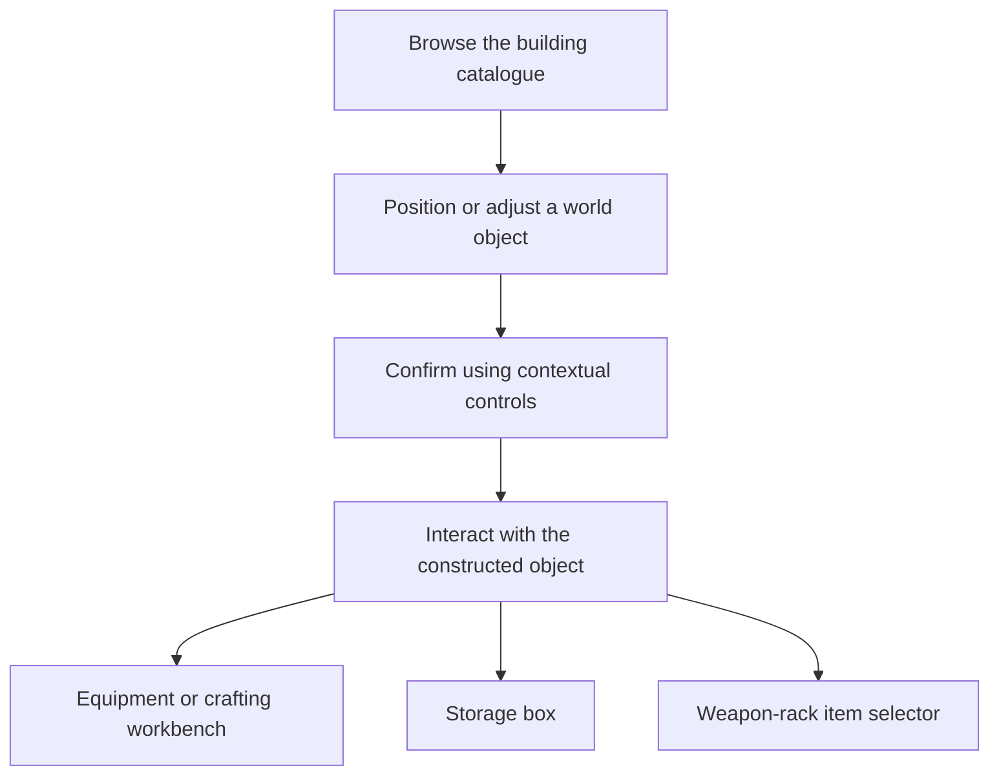
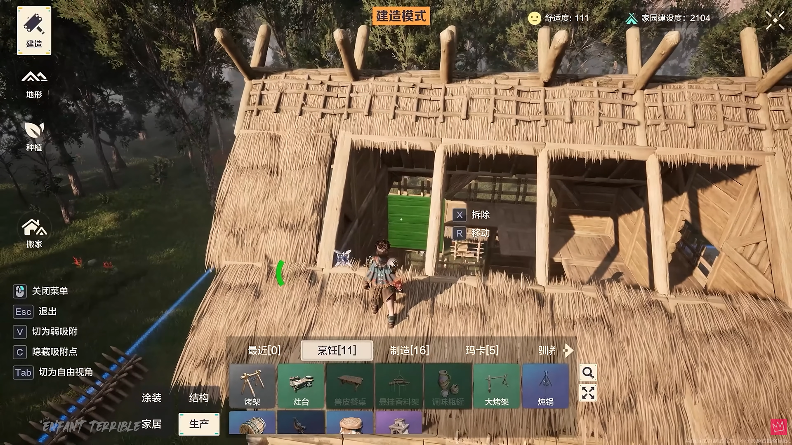
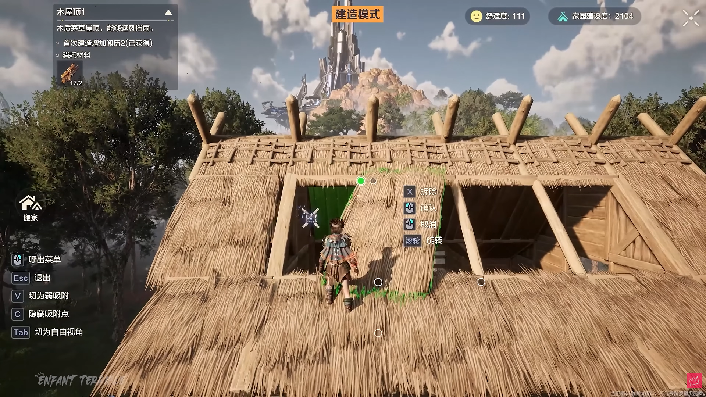
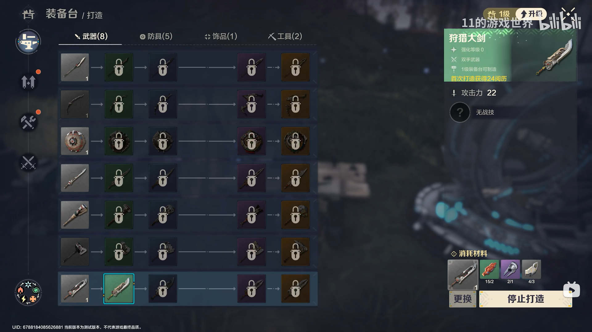
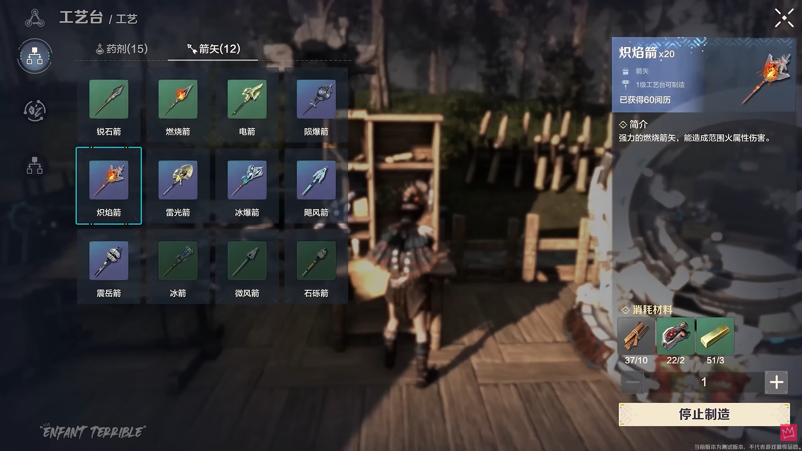
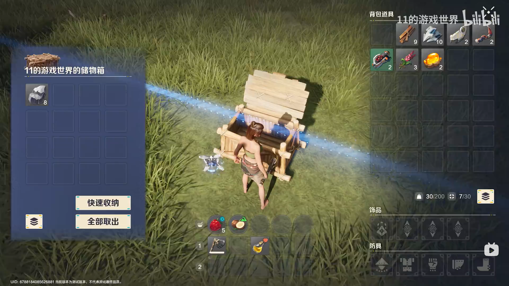

# Building UI: from placement to useful objects

**Evan (Yaxin) Ge · C++ / Lua / UMG · ProjectZ engineering case study**

How does a building system become a usable player experience? This case connects catalogue navigation and world-placement controls with equipment crafting, storage and object-specific interactions.

I initiated the building system and developed its gameplay and associated UI. My work also included development and maintenance of building-object interactions and their panels, using the team's shared UI and gameplay infrastructure.

[中文案例](docs/README.zh-CN.md) · [Full case study](docs/CASE_STUDY.md) · [Workbench actions](docs/WORKBENCH_INTERACTIONS.md) · [Architecture](docs/ARCHITECTURE.md) · [Code tour](docs/CODE_TOUR.md)

## Three engineering decisions

**1. Make the controls reflect the current world and input context.**

The native placement flow publishes available operations; Lua maps them to controls and checks the active input/HUD mode. An invalid confirm attempt can explain the failure without creating an object. This separates useful player feedback from permission to execute. [Placement case](docs/CASE_STUDY.md#1-from-catalogue-selection-to-placement).

**2. Give a blocked crafting action a meaningful next step.**

The equipment-workbench action area distinguishes production in progress, paused work, collectable output, requirements and local crafting. A level requirement opens upgrade guidance; missing materials opens tracking; a carry limit blocks crafting. The included path follows the product widget through the panel and model to native dispatch. [State, actions and trade-offs](docs/WORKBENCH_INTERACTIONS.md).

**3. Share presentation while keeping object rules explicit.**

Storage gestures converge on transfer commands. A weapon rack uses a common item selector but retains its own compatibility rules, item-source coordinates and occupancy feedback. Reuse belongs at the stable interface boundary, not in a panel that must understand every object's behaviour. [Storage](docs/CASE_STUDY.md#4-storage-several-gestures-one-transfer-boundary) · [Weapon rack](docs/SHARED_INTERACTIONS.md).

The result is a connected feature: players can select and position an object, then use its specialised interface with clear actions and world-bound context.

## The player experience

Workbench, storage and rack interactions are alternative uses of constructed objects.

## Gameplay screenshots

Five separate states from public gameplay footage, with English captions. Original images and creator watermarks are preserved; these stills illustrate interfaces rather than a continuous click-through. [Sources and label translations](media/README.md).

### 1. Building catalogue open

**Focus on the bottom catalogue and left-side controls.** The player browses categories while the world remains visible. The selected world piece exposes **Delete** and **Move**.

### 2. World placement / adjustment

With the catalogue closed, the player positions or adjusts a roof piece using **Confirm**, **Cancel**, **Rotate** and **Delete**. Materials and item information remain visible. The available input follows the current UI and building mode, keeping world actions distinct from menu navigation.

### 3. Equipment workbench — crafting

Interacting with an **equipment workbench** opens this crafting interface. **Weapons / Armour / Accessories / Tools** organise products; the selected item's details and materials appear on the right. The current action reads **Stop crafting**. [Follow the primary-action logic](docs/WORKBENCH_INTERACTIONS.md).

### 4. Crafting workbench — consumables and ammunition

**Potions / Arrows** lead to product details, material requirements and quantity controls. The current action reads **Stop crafting**. This workbench has its own model and panel lifecycle.

### 5. Storage box and player inventory

The left panel shows box contents with **Quick store** and **Take all**. The right side shows the player's inventory. The chest remains visible between them, retaining the world context of the transfer.

## Explore the implementation

Start with [placement and workbench decisions](docs/CASE_STUDY.md), then follow the [guided code tour](docs/CODE_TOUR.md). Supporting chapters cover [shared interactions](docs/SHARED_INTERACTIONS.md), [storage refresh costs](docs/PERFORMANCE.md), and [debugging / remaining edge cases](docs/DEBUGGING.md). The separate semi-finished-goods queue and weapon rack are code-only examples.

## Scope and verification

This source-reading portfolio contains selected implementations, interface outlines and newly written focused tests. Shared infrastructure was maintained collaboratively by the team. Omitted bodies are labelled; the full Unreal runtime, services and binary widgets are external. [Dependencies and implementation map](docs/DEPENDENCIES.md) · [Test results and validation boundaries](docs/TESTING.md).

The tests establish selected behaviour, not measured shipping performance or full in-engine validation. Game visuals and project material remain subject to their respective rights.

**Companion case:** [Multiplayer UI — team flow, contextual support and asynchronous correctness](https://github.com/seak123/multiplayer-ui-portfolio).
