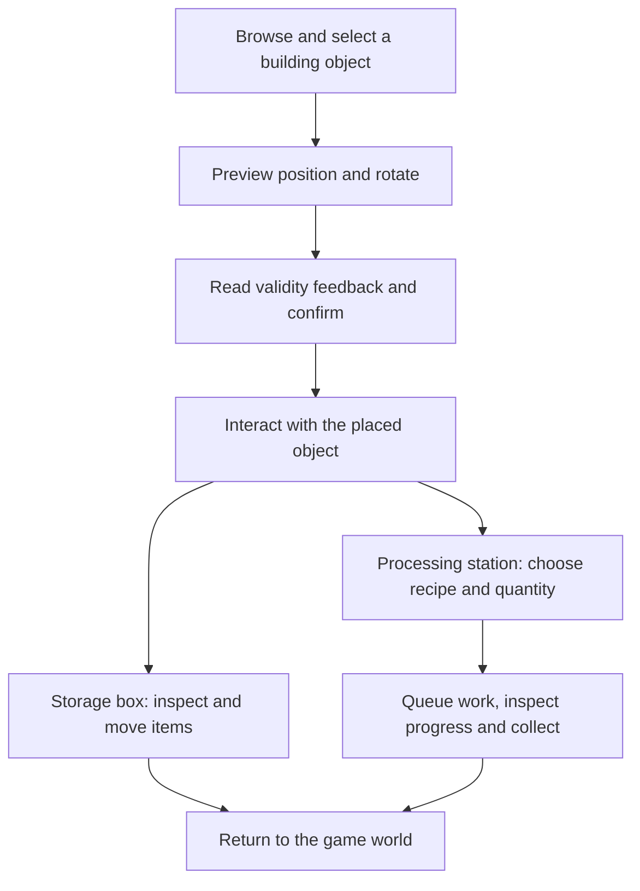

# Building UI: from placement to useful objects

**Evan (Yaxin) Ge · C++ / Lua / UMG · ProjectZ engineering case study**

A connected feature spanning the building catalogue, placement controls, world interactions, processing-station queues and storage containers. The challenge is to turn changing gameplay rules into clear player actions while keeping UI state, world-object identity and native commands aligned.

I initiated the building system and worked on its gameplay and associated UI. My development and maintenance also covered building-object interactions and their panels. This case organises those work records around selected implementation paths. Shared UI and gameplay infrastructure were maintained collaboratively by the team.

[中文案例](docs/README.zh-CN.md) · [Full case study](docs/CASE_STUDY.md) · [Architecture](docs/ARCHITECTURE.md) · [Code tour](docs/CODE_TOUR.md) · [Refresh and performance](docs/PERFORMANCE.md) · [Debugging and edge cases](docs/DEBUGGING.md)

## The player experience

These are connected player activities, not a claim that one class or universal state machine controls all three systems. The processing example is the **semi-finished-goods production panel**, not the separate equipment-upgrade workbench.

## Four engineering decisions

**1. Derive the available operations from gameplay state.** Native placement logic produces an operation bitmask; Lua uses it to present build, rotate, move, repair and cancel controls. Keyboard actions additionally check the current input and HUD mode. An invalid placement can still accept a confirm attempt to explain the failure: it must not create the object.

**2. Keep object identity attached to the interface.** A processing panel carries a building ID, instance GUID and interaction ID. Queue and leave events are filtered against that context. Storage routes commands through the current box GUID and closes its panel when the player leaves range.

**3. Give blocked actions a useful next step.** Processing distinguishes locked recipes, unmet conditions, insufficient materials and a full queue. The material-shortage action opens material tracking rather than merely disabling a button. Production progress is a presentation of native work data; it is not permission to grant items.

**4. Reuse at the right boundary.** Storage keeps slot-data objects when capacity is unchanged and refreshes displayed entries; capacity changes rebuild the list. Processing and storage share framework facilities without being forced into a single generic panel. [Implementation and cost boundaries](docs/PERFORMANCE.md).

## Gameplay media

**Screenshots and clips have not yet been added.** The [media section](media/README.md) defines four useful captures and English captions: placement validity, input-mode changes, processing queues and storage transfers. Diagrams describe relationships; they are not substitute screenshots of the shipped game.

## Read the code in ten minutes

1. [BuildSpaceModel](Content/Lua/GameLogics/BuildSpace/BuildSpaceModel.lua) → [operation widget](Content/Lua/GameLogics/BuildSpace/BuildSpaceOperatWidget.lua): selection, operation masks and input routing.
2. [Native hold/placement flow](Source/ProjectZ/GameLogic/Building/PzBuildHoldFlowSystem.cpp): ordered checks, changed-state notification and confirmation.
3. [BuildProduceModel](Content/Lua/GameLogics/BuildProduce/BuildProduceModel.lua) → [processing panel](Content/Lua/GameLogics/BuildProduce/SemiProduce/SemIProduceFrame.lua) → [queue row](Content/Lua/GameLogics/BuildProduce/SemiProduce/SemiProduceSlotEntry.lua): recipe eligibility, contextual actions and progress.
4. [BoxModel](Content/Lua/GameLogics/Box/BoxModel.lua) → [storage view](Content/Lua/GameLogics/StorageBox/StorageBoxWidget.lua) → [native container routing](Source/ProjectZ/GameLogic/LogicLibrary/PzLogicLibrary.cpp): several input gestures, one request boundary.
5. [Tests](docs/TESTING.md): focused Lua checks and clearly separated runtime-validation targets.

## Scope

This is a source-reading portfolio, not a runnable Unreal project. Module paths, selected method bodies and their relationships remain visible. `-- Implementation omitted.` marks out-of-scope bodies; C++ headers are interface outlines. The [implementation map](docs/source-manifest.json) lists included methods and displayed-file checksums. Engine code, binary assets, backend implementation and generated configuration/protocol definitions are not included. [Dependency contracts](docs/DEPENDENCIES.md).

The tests use controlled doubles and selected Lua methods. They do not measure shipping FPS, prove complete network correctness or execute the native renderer. Project material and game visuals remain subject to their respective rights; no licence to the original game assets is granted.
