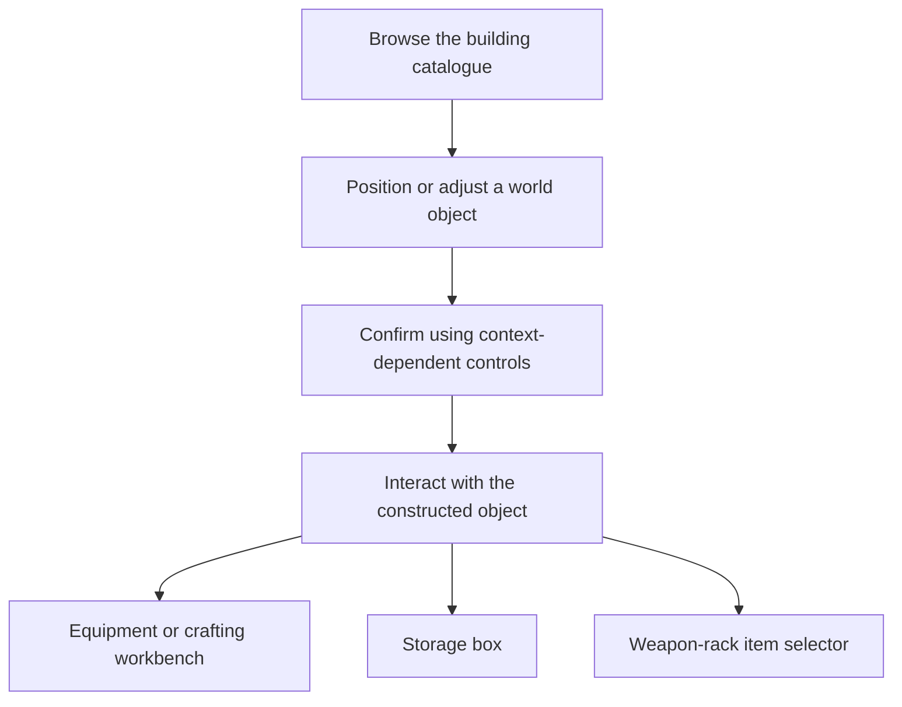

# Building UI: from placement to useful objects

**Evan (Yaxin) Ge · C++ / Lua / UMG · ProjectZ engineering case study**

A connected feature spanning the building catalogue, world-placement controls and interfaces opened by interacting with constructed objects: equipment workbenches, crafting workbenches, storage boxes and weapon racks. The challenge is to keep player intent, world-object identity, available actions and UI state aligned.

I initiated the building system and worked on its gameplay and associated UI. My development and maintenance also covered building-object interactions and their panels. Shared UI and gameplay infrastructure were maintained collaboratively by the team.

[中文案例](docs/README.zh-CN.md) · [Full case study](docs/CASE_STUDY.md) · [Workbench integration](docs/WORKBENCH_INTERACTIONS.md) · [Shared interactions](docs/SHARED_INTERACTIONS.md) · [Architecture](docs/ARCHITECTURE.md) · [Code tour](docs/CODE_TOUR.md)

## The player experience

These are alternative uses of built objects, not one mandatory sequence or a universal state machine. **Equipment crafting means opening the equipment workbench's crafting interface; it does not mean equipping an item into a character slot.**

## Gameplay screenshots

Five stills from gameplay footage, supplied for this case. Original images and creator watermarks are preserved. They show separate UI states, **not a recording of the clicks or transitions between them**. English labels below are explanatory translations. [Source notes and label guide](media/README.md).

### 1. Building catalogue open

**Focus on the bottom catalogue and left-side controls.** The player can browse building categories while the world remains visible. The selected world piece exposes **Delete** and **Move** actions. This is the catalogue-open state, not proof that a new object has been placed.

### 2. World placement / adjustment

The catalogue is closed and a roof piece is being positioned or adjusted in the world. Contextual controls show **Confirm**, **Cancel**, **Rotate** and **Delete**; the upper-left panel shows the piece description and materials. This still illustrates the operation state, not a completed placement or an invalid-placement failure.

### 3. Equipment workbench — crafting

This is the crafting screen opened through interaction with an **equipment workbench in the world**, not the character's equipment slots. **Weapons / Armour / Accessories / Tools** tabs organise products; the right side presents the selected item's details and required materials. The current action reads **Stop crafting**. [Object-to-panel integration](docs/WORKBENCH_INTERACTIONS.md).

### 4. Crafting workbench — consumables and ammunition

The **Potions / Arrows** categories lead to product details, material counts and quantity controls; the current action reads **Stop crafting**. This workbench is distinct from the equipment workbench above. It is also **not** a screenshot of the separate `SemiProduce` queue panel included as supporting code.

### 5. Storage box and player inventory

The left panel shows the box contents with **Quick store** and **Take all** actions. The right side shows the player's bag and inventory sections. The chest remains visible between them, connecting the interface to its world object. The equipment slots visible here belong to the inventory view; they are unrelated to the equipment-workbench crafting screen.

## Engineering decisions

**Derive operations from gameplay state.** Native placement code publishes an operation mask; Lua presents the relevant controls and checks the input/HUD context. Invalid confirmation can produce a reason without creating an object. [Placement code](Source/ProjectZ/GameLogic/Building/PzBuildHoldFlowSystem.cpp).

**Carry world-object context into the panel.** Workbench opening retains object context and starts a distance-based leave check with a small margin beyond interaction range. Hide and cleanup are separate operations. [Workbench integration](docs/WORKBENCH_INTERACTIONS.md).

**Share presentation without burying object rules in it.** The weapon-rack adapter filters eligible items and retains their source container/position; the shared selector handles title, rows and contextual closure. This remains a code-focused example; no weapon-rack screenshot is included. [Shared interaction case](docs/SHARED_INTERACTIONS.md).

**Preserve list structure when only content changes.** Storage retains slot records at stable capacity and refreshes displayed entries, rather than rebuilding the list on every update. It still scans capacity slots. [Performance boundaries](docs/PERFORMANCE.md).

The separate semi-finished-goods production example remains in the [full case study](docs/CASE_STUDY.md): recipe eligibility, material tracking, queue state and progress presentation. No supplied screenshot is presented as that panel.

## Read the code

Start with the [guided code tour](docs/CODE_TOUR.md), then [debugging and edge cases](docs/DEBUGGING.md) and [focused tests](docs/TESTING.md).

This is a source-reading portfolio, not a runnable Unreal project. Selected implementations retain module paths and calling relationships. `-- Implementation omitted.` marks out-of-scope bodies; C++ headers are interface outlines. The [implementation map](docs/source-manifest.json) lists included methods and file checksums. [External dependencies](docs/DEPENDENCIES.md).

Tests use controlled collaborators; they do not measure shipping FPS or validate the full renderer, network or server. Game visuals and project material remain subject to their respective rights; no licence to the original game assets is granted.
