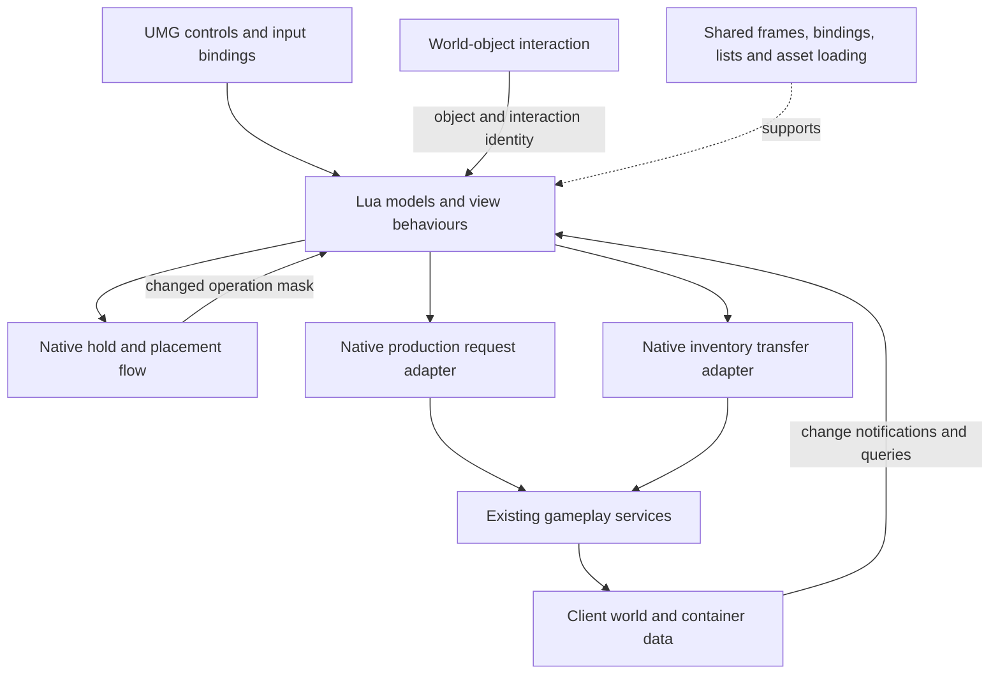

# Architecture and interaction contracts

[Overview](../README.md) · [Code tour](CODE_TOUR.md) · [Dependencies](DEPENDENCIES.md)

## Engineering context

This was an Unreal Engine 4 gameplay feature with UI across world placement and constructed-object interactions. The player-facing requirements are introduced in the [feature background](CASE_STUDY.md#feature-background).

- **C++ building and gameplay systems** handle held/selected world objects, placement evaluation and operation availability, object interactions, production state and inventory request paths. A client placement check provides feedback; it is not a substitute for server validation.
- **Lua feature models and behaviours** keep catalogue or recipe selection, connect an open panel to its world-object context, derive visible actions from gameplay data and forward player intent. They use events, queries and scoped checks to keep the interface current.
- **UMG widgets and the existing UI framework** provide layouts, controls, animations, bindings, frames and lists. Workbench, storage and selector interfaces use those facilities with their own composition and interaction rules.
- **Object and recipe configuration** supplies categories, requirements and item relationships. This lets content changes flow through established data and presentation paths while feature code handles the decisions those values drive.

I worked across the building gameplay and these interface connections. The boundaries below explain how a player action keeps its mode, object and item context as it moves between those layers.

## System overview

## Placement contract

`BuildSpaceModel` manages UI selection. `PzBuildHoldFlowSystem` manages held/selected world objects, placement checks and the operation mask. `BuildSpaceOperatWidget` maps that mask into controls and routes actions back. The main frame handles presentation and PC/touch-control visibility. Direct Lua-to-native calls are part of this design; not every operation passes through a view-model.

The mask is a summary of available operations, not a replacement for detailed failure reasons. Native `UnValidTag` provides that detail when a confirm attempt cannot proceed. An unchanged mask avoids a redundant notification but does not stop native placement evaluation.

## Processing contract

An interaction opens the panel with `(PieceID, PieceGuid, InteractionID)`. The unexported general dispatcher connects `BUILDING_OP_TYPE_OPEN_SEMIPRODUCE` to `OpenSemiProduceFrame`; the public code begins with the model's event binding and includes the downstream panel and request adapter.

`BuildProduceModel` owns recipe-data derivation and selected recipe. `SemiProduceFrame` owns panel-local quantity, primary-action state and queue presentation. A queue row carries its piece GUID and zero-based slot index. Native queue data remains the source of work and completed-output information.

A GUID identifies the instance, a configuration ID identifies its kind, and an interaction ID identifies the action. They are not interchangeable. The leave handler checks instance and interaction; the queue handler checks instance only because it consumes that instance's work data.

## Storage contract

The existing object interaction sends `LogicEvent_Box_Open(ConfigId, Guid)`. `BoxModel` keeps the current context; `StorageBoxFrame` composes inventory subviews; `StorageBoxWidget` and `StorageBagWidget` refresh their side of the view. `PzLogicLibrary` routes transfers to inventory/storage services.

The panel's 0.2-second range check is a client presentation rule, not server authority. A native request return or Lua `true` indicating dispatch is not acknowledgement of a completed inventory mutation. Shared container-update events supply the resulting state.

## Workbench state and command contract

`WorkBenchModel` and `PalWorkBenchModel` handle distinct world-workbench interfaces. Opening establishes object context, starts a named leave check and binds the asynchronous frame.

For equipment crafting, `WorkBenchProduct` combines native production queries with eligibility fields held by `WorkBenchModel`. It maps them to guidance, tracking, start, cancel or collect actions. `WorkBenchPanel` handles mode-specific dispatch and confirmation policy; `WorkBenchModel` handles action checks and the local-progress/native-queue split. Product-population methods outside the excerpt supply the eligibility fields. This shared mutable state is a coupling to understand, not a fully separated MVVM design.

Production notifications and a scoped one-second state poll re-evaluate the product action. Native data determines collectability. [State, actions and lifecycle](WORKBENCH_INTERACTIONS.md).

## Weapon-rack selection contract

`AdditionWeaponShelfModel` supplies the common frame-data shape. `AdditionModel` keeps the current object/type and opens `AdditionFrame`; `AdditionItem` emits row selection. The rack adapter checks the key and calls a native command carrying source-container coordinates. The frame owns title/list and contextual closure, not world occupancy or item mutation. [Detailed case](SHARED_INTERACTIONS.md).

## Shared facilities, specialised behaviour

- **Bindings:** `Elements`, `Behaviours` and event settings connect named UMG controls to Lua methods. Missing bindings are integration failures, not recipe-state failures.
- **Frames:** `UIUtil.AddUniqueFrameAsync` creates a frame; behaviour lookup supplies its context. Uniqueness alone does not cancel obsolete open requests.
- **Lists:** `DataObjectPool` carries Lua data into native list APIs. Data reuse and widget-entry reuse are separate mechanisms.
- **Images:** shared asynchronous image helpers support item art. No additional feature-level request-cancellation guarantee is inferred from their existence.
- **Cleanup:** delegate cleanup, leaving an interaction and hiding a frame are distinct responsibilities. Hidden-versus-destroyed semantics depend on the frame manager.

The separate production and storage models reflect different workflows. A reusable base panel would only help if it expressed a stable common contract; the shared runtime already handles the lower-level common work.
