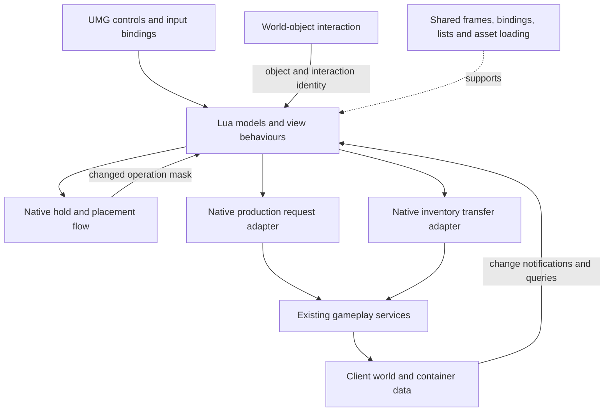

# Architecture and interaction contracts

[Overview](../README.md) · [Code tour](CODE_TOUR.md) · [Dependencies](DEPENDENCIES.md)

## Placement contract

`BuildSpaceModel` manages UI selection. `PzBuildHoldFlowSystem` manages held/selected world objects, placement checks and the operation mask. `BuildSpaceOperatWidget` maps that mask into controls and routes actions back. The main frame handles presentation and PC/touch-control visibility. Direct Lua-to-native calls are part of this design; not every operation passes through a view-model.

The mask is a summary of available operations, not a replacement for detailed failure reasons. Native `UnValidTag` provides that detail when a confirm attempt cannot proceed. An unchanged mask avoids a redundant notification but does not stop native placement evaluation.

## Processing contract

An interaction opens the panel with `(PieceID, PieceGuid, InteractionID)`. The unexported general dispatcher connects `BUILDING_OP_TYPE_OPEN_SEMIPRODUCE` to `OpenSemiProduceFrame`; the public code begins with the model's event binding and includes the downstream panel and request adapter.

`BuildProduceModel` owns recipe-data derivation and selected recipe. `SemiProduceFrame` owns panel-local quantity, primary-action state and queue presentation. A queue row carries its piece GUID and zero-based slot index. Native queue data remains the source of work and completed-output information.

A GUID identifies the instance, a configuration ID identifies its kind, and an interaction ID identifies the action. They are not interchangeable. The leave handler checks instance and interaction; the queue handler checks instance only because it consumes that instance's work data.

## Storage contract

The existing object interaction sends `LogicEvent_Box_Open(ConfigId, Guid)`. `BoxModel` keeps the current context; `StorageBoxFrame` composes inventory subviews; `StorageBoxWidget` and `StorageBagWidget` refresh their side of the view. `PzLogicLibrary` routes transfers to inventory/storage services.

The panel's 0.2-second range check is a client presentation rule, not server authority. A native request return or Lua `true` indicating dispatch is not acknowledgement of a completed inventory mutation. Shared container-update events supply the resulting state.

## Weapon-rack / incubator selection contract

`AdditionWeaponShelfModel` and `AdditionEggModel` construct the same frame-data shape. `AdditionModel` keeps the current object/type and asynchronously opens the shared `AdditionFrame`. `AdditionItem` emits a selection event carrying the row data. The adapters check the interaction key and call different native commands.

Rack rows retain source-container coordinates. Egg rows retain type/count; native incubator capacity is queried when clicked. The frame filters leave events by object and interaction, and prevents overlap with the main menu. It does not own world occupancy, incubation timing or item mutation. [Detailed case](SHARED_INTERACTIONS.md).

## Shared facilities, specialised behaviour

- **Bindings:** `Elements`, `Behaviours` and event settings connect named UMG controls to Lua methods. Missing bindings are integration failures, not recipe-state failures.
- **Frames:** `UIUtil.AddUniqueFrameAsync` creates a frame; behaviour lookup supplies its context. Uniqueness alone does not cancel obsolete open requests.
- **Lists:** `DataObjectPool` carries Lua data into native list APIs. Data reuse and widget-entry reuse are separate mechanisms.
- **Images:** shared asynchronous image helpers support item art. No additional feature-level request-cancellation guarantee is inferred from their existence.
- **Cleanup:** delegate cleanup, leaving an interaction and hiding a frame are distinct responsibilities. Hidden-versus-destroyed semantics depend on the frame manager.

The separate production and storage models reflect different workflows. A reusable base panel would only help if it expressed a stable common contract; the shared runtime already handles the lower-level common work.
