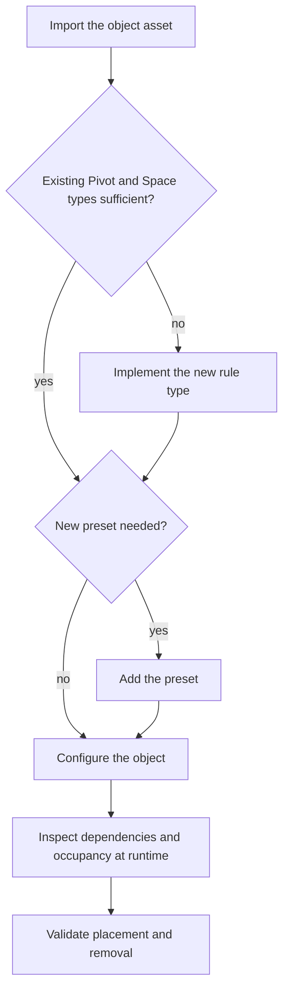

# Building configuration and authoring workflows

[Overview](../README.md) · [System design](SYSTEM_DESIGN.md) · [Early spatial model](SPATIAL_RULES.md)

The system had to support the people producing building content as well as the player placing it. Two workflows addressed different needs: defining a new kind of piece, and assembling a complete building for world placement.

## Configuring an early building type

The SpaceUnit model made support and occupancy explicit. I connected those descriptions to presets, XML configuration and runtime debugging. A new visual variant could reuse existing semantics; a genuinely new Pivot or Space behaviour still needed implementation.

This is a redrawn summary of the historical content path, rather than an editor screenshot:

Dependency output and Pivot/Space visualisation helped distinguish an incorrect footprint, missing support and an interaction problem. Runtime configuration made those relationships easier to inspect. Occupancy-painting and more dynamic authoring tools were future directions at this stage, not already delivered features.

## Authoring complete buildings

Designers later needed complete interactive buildings as open-world content. I developed the workflow to enter an authoring mode, construct and record pieces, save a building for later editing, and export its serialised layout.

The layout described the pieces and their relative arrangement. Editor placement described where the complete building belonged in the map. Keeping those two forms separate let designers revise a building and level designers work with its world placement.

The exported layout could be previewed and positioned in the editor, with its map placement saved for the content pipeline. **The tools team implemented the level-editor build/export stage** that included the content in the built map data. My work connected the building authoring and data workflow to that boundary.

## Player building blueprints

Player-facing blueprints extended that foundation with catalogue selection, whole-building preview, position/rotation adjustment and placement requests. They reused the layout concept and existing building operations while retaining player-specific validation and permissions.

This was an evolution of the workflow, not a claim that the first authoring tool anticipated every later gameplay need. It also did not make editor-authored content and player runtime persistence the same storage path.

## Outcome

The team could define new pieces, inspect their rule data, and assemble reusable building content through repeatable workflows. Later player blueprints reused that foundation rather than starting with an unrelated representation. The design kept new content semantics, assembled layouts and map placement as distinct kinds of change.

[Historical workflow scope](EVIDENCE.md#historical-system-design) · [Player controls and UI](CASE_STUDY.md#1-from-catalogue-selection-to-placement)
