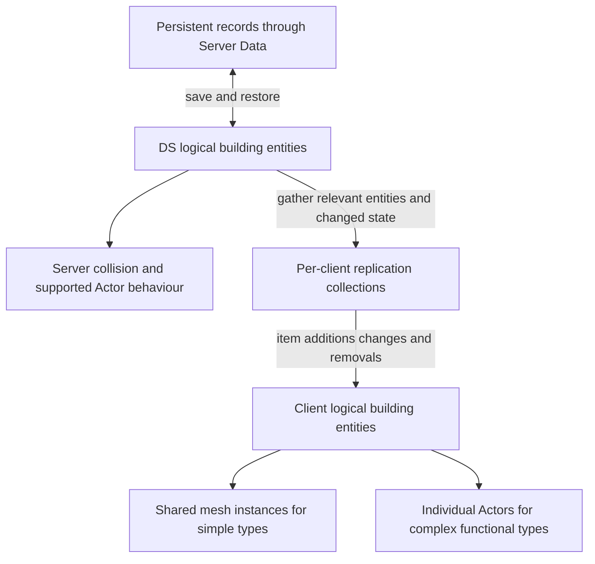

# Building lifecycles and scale

[System design](SYSTEM_DESIGN.md) · [Spatial rules](SPATIAL_RULES.md) · [Performance work](PERFORMANCE.md#dynamic-navigation-and-world-change-cost)

Players continued to operate on individual buildings as the world grew. The implementation no longer had to carry every building as a permanently loaded, individually replicated Actor.

## Records and runtime representation

A persistent record retains the building identity and state needed for restoration. A runtime entity, Actor or mesh instance supplies loaded gameplay and representation. Server Data connects these forms through save/restore paths and backend services.

Early player-centred storage evolved into records organised by server streaming regions as construction expanded across the map. Region loading restores needed content; unloading releases runtime content while the persistence path retains the accepted world state. The building subsystem does not directly become the database service.

Three events must stay distinct:

1. A client leaves an area and no longer needs its local representation.
2. A server region unloads and later restores its buildings from records.
3. A player demolishes a building through an authoritative gameplay operation.

The first two are lifetime changes. The third changes which buildings should exist in future saved state. Successful placement, replication and saving are related processes with different completion times.

## LiteMass integration

We integrated LiteMass to reduce the need for individual Actors for simple buildings while preserving per-building state and operations. This describes its role in the building system, not authorship of the entire shared framework.

This separates **logical identity**, **what a client receives** and **how a loaded object is represented**. Individual Actor paths can coexist with instanced rendering; the two representation boxes are not a universal either/or classification.

### Entity identity

Each logical building retains identity, type, transform and gameplay state such as health and support. Its persistent GUID, runtime entity handle, network identity and current representation answer different questions. A saved building can survive restoration even though an old runtime handle or Actor pointer cannot.

Object management resolves an individual building for operations. Changing an entity through the managed mutation path keeps its version and notifications in step with its data.

### Replication sets

A client-specific collection carries the buildings relevant to that client. Gathering selects membership; version checks avoid resubmitting unchanged state; FastArray communicates item additions, changes and removals. Submission budgets can spread work over updates, with some delivery delay.

This is collection-item delta replication, not a promise that every packet contains only one changed scalar field. Client callbacks update local entities, which then drive representation. Clients do not receive the DS's mesh-component collection as a finished scene.

### Representation and collision

Simple types can use shared instanced static-mesh representation rather than an Actor each. Complex functional objects can retain individual Actors for their behaviour. Actor-backed objects and instanced rendering can also coexist.

The DS still needs collision/query representation for authoritative gameplay; clients additionally need visible presentation. Fewer Actors does not mean no collision or no components. Network collections and rendering batches group different things and need not have identical membership.

### Existing interfaces and proxies

Legacy building operations often used a common Actor-facing interface. A scoped proxy can resolve a real Actor or temporarily bind entity data to a shared proxy for supported operations. This reduces migration work while preserving functional exceptions.

The caller must retain a building identity, not hold a pooled proxy through an asynchronous callback. The proxy can be rebound. This is an access-lifetime trade-off, not a hidden one-proxy-per-building implementation.

## One wall through the system

For a simple wall without an individual Actor:

1. **Preview:** the flow proposes a position and rules supply local feedback.
2. **Accept:** the DS validates current conditions and creates authoritative building state.
3. **Represent on the server:** entity data drives the required collision/query representation.
4. **Synchronise and present:** relevant client collections send the addition and later changes; client entities retain the wall's individual identity and drive its local representation.
5. **Operate:** selection, damage, movement or removal resolves that identity even when the rendering is instanced.
6. **Save and restore:** Server Data serialises accepted state through its own lifecycle and reconstructs loaded buildings by region.
7. **Demolish:** authoritative deletion updates runtime state, replication and subsequent persistence. Hiding a mesh alone does not complete it.

## What the separation cost

The design needs identity mappings, asynchronous validity checks and coordination between entity data and functional Actors arriving separately. Proxy access has a bounded lifetime. Complex types remain more expensive because their behaviour warrants it.

The benefit is the ability to tune entity storage, replication and representation separately while retaining individual gameplay operations. Actor counts, loading cost, CPU, memory and network cost must be measured separately; batching alone is not a performance result.

[Evidence scope](EVIDENCE.md) · [Content workflows](AUTHORING_WORKFLOW.md) · [UI interaction lifetimes](ARCHITECTURE.md)
