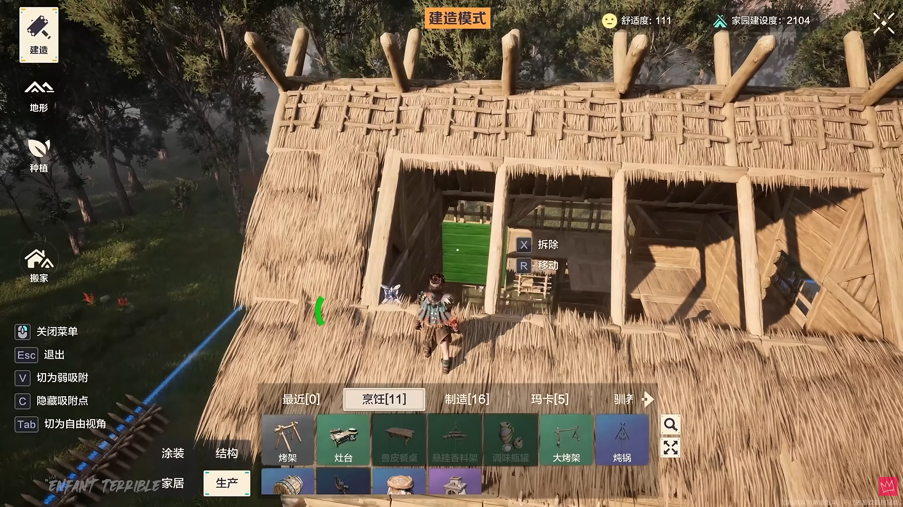
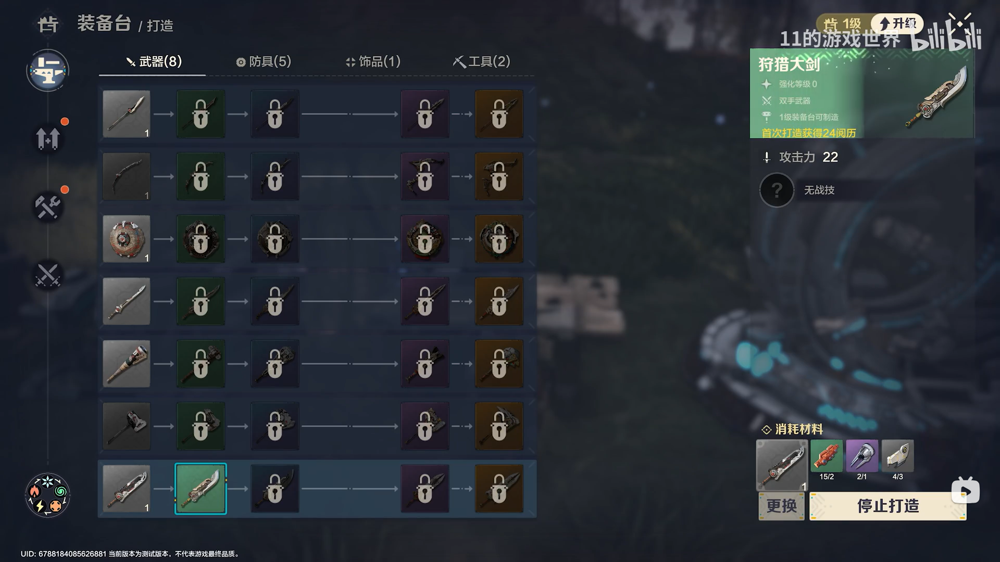
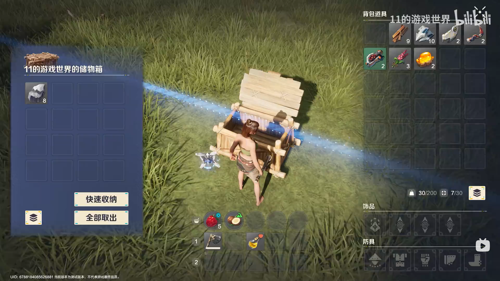
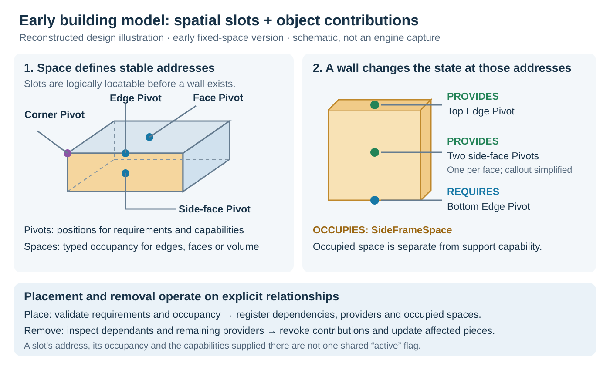

# 建造系统：从放置操作到持久化世界

从选择和放置物件、保存世界中的建筑，到制造装备、存取道具和选择物品，连接 gameplay、UI 与持续存在的世界内容。

**Evan（Yaxin）Ge · C++ / Lua / UMG · ProjectZ**

[English](../README.md) · [系统背景](#系统背景) · [功能截图](#功能截图) · [我的工作](#我的工作) · [系统设计与演化](#系统设计与演化) · [深入阅读](#深入阅读)

## 系统背景

ProjectZ 的建造功能让玩家搭建结构和功能性物件，再在玩法中使用它们。玩家打开目录、选择物件，在世界中调整或吸附预览并确认放置，也可以选中已有物件进行移动和拆除。建成后，工作台提供制造与生产，储存箱提供道具存取，武器架提供物品选择交互。

需求覆盖了几种不同的体验：世界放置需要清楚的操作提示与有效性反馈，制造需要展示产品、条件与生产状态，储存需要一致的道具操作。界面还必须保留当前交互对象，并在玩家离开时作出响应。策划需要调整配方和规则，UI 美术需要迭代布局与动画。

建造系统由我起头开发，我的工作覆盖 gameplay 与配套 UI，使用 Unreal Engine 4、C++、Lua 和 UMG。原生系统负责世界操作与玩法数据，Lua 通过项目已有的 UI 框架，把这些数据和玩家操作接到 UMG 控件上。

更完整的系统还需要让建筑在一次交互或区域卸载之后继续保存，支持内容制作工作流，并应对世界中不断增多的建造物。设计从早期固定空间内的规则化建造，逐步演化为后来的自由建造、随服务器区域组织的持久化和批量运行时表现。

[玩家流程与负责内容](CASE_STUDY.md#feature-background) · [整体系统设计](SYSTEM_DESIGN.md) · [C++／Lua／UMG 接入](ARCHITECTURE.md#engineering-context)

## 功能截图

三张图分别展示建造入口、专用制造面板与通用存储交互。[全部五张图、英文标签和素材来源](../media/README.md)。

### 建造目录与上下文操作

**功能：**玩家在世界可见的状态下浏览分类、选择物件；当前选中物件显示移动与拆除操作。目录显隐、建造模式和输入上下文共同决定可用操作。

**相关工作：**目录选择与取消、快捷键和 HUD 上下文检查，以及原生放置操作到 Lua 控件的连接。

[功能流程](CASE_STUDY.md#1-from-catalogue-selection-to-placement) · [选择与输入代码](CODE_TOUR.md#1-select-an-object) · [另一个状态：放置预览截图](../media/README.md#world-placement--adjustment)

### 装备台：制造路线、材料与主操作

**功能：**与装备台交互后，选择武器、防具、饰品或工具，查看进化路线、装备详情和材料，再执行对应操作。图中当前为“停止打造”。

**相关工作：**专用布局、产品选择与材料数据，以及生产、暂停、领取、条件限制和恢复入口的状态处理。

[装备台完整案例](WORKBENCH_INTERACTIONS.md) · [专用与通用的边界](DECISIONS.md#1-keep-workbench-composition-specialised) · [从按钮到原生请求](CODE_TOUR.md#7-follow-the-equipment-workbench-action-end-to-end)

### 储存箱：世界上下文中的双侧道具操作

**功能：**同时查看箱内与背包物品，通过单件或快速收纳、全部取出等批量动作转移道具。

**相关工作：**箱子与背包视图组合、容器与槽位身份、转移命令，以及远离箱子或切换对象时的交互生命周期。

[转移流程](CASE_STUDY.md#4-storage-several-gestures-one-transfer-boundary) · [实现路线](CODE_TOUR.md#5-open-and-use-storage) · [槽位刷新成本](PERFORMANCE.md)

**其他图与功能直接入口：**

- [放置／调整截图](../media/README.md#world-placement--adjustment)：确认、取消、旋转，以及材料与有效性反馈。[完整图片](../media/screenshots/Building_Placement.png)。
- [工艺台截图](../media/README.md#crafting-workbench)：药剂与箭矢分类、材料、数量和制造操作。[完整图片](../media/screenshots/Crafting_Workbench.png) · [工作台生命周期](WORKBENCH_INTERACTIONS.md)。
- [武器架](SHARED_INTERACTIONS.md)：共用选择面板与专用物品筛选、来源槽位；代码案例。
- [加工生产队列](CASE_STUDY.md#3-a-processing-station-with-a-meaningful-primary-action)：配方条件、数量、队列容量与进度；代码案例。

## 我的工作

我的负责范围贯穿“建造一个物件”到“使用这个物件”。我起头开发建造系统，完成相关玩法与 UI，也持续参与建造物件交互逻辑及面板的开发、维护。

- **系统设计与规则：**划分输入、客户端建造控制流、共用规则校验、物件管理和服务器持久化。实现早期空间槽位模型，并随玩法变化迭代建造规则。
- **建造流程与操作：**连接原生放置流程与 Lua 目录，处理选择、预览、放置检查、取消、移动／拆除和上下文反馈，使快捷键与按钮符合当前输入及建造模式。
- **制造与加工：**开发、维护工作台界面、选中产品详情、材料、生产状态，以及开始、取消和领取路径；区分已有任务与新制作的条件。
- **储存箱与武器架交互：**把世界中的交互入口接到箱包界面和道具选择器；单件、拖拽及批量操作和原生请求都保留物件、容器与槽位身份。
- **UI 方案决策：**为装备进化关系与类别排版保留专用面板，复用稳定的库存和道具选择约定；缺材料进入公共配方追踪，等级不足进入升级引导。
- **生命周期与维护：**处理进入／离开物件交互、面板清理与状态刷新，接入玩法层管理的生产和容器数据，避免关闭界面意外改变玩法任务。
- **内容接入：**连接配置、Lua 模型、事件和 UMG 绑定，使策划能调整条件、UI 美术能调整布局动画，并沿用既有项目工作流。
- **持久化与规模：**分离建筑数据与运行时表现的生命周期，对接服务器区域的保存／恢复，并参与建造系统与 LiteMass 的实体、复制和批量表现接入。
- **工作流与性能：**开发建造物配置／调试与完整建筑方案制作流程，覆盖保存、继续编辑、导出，以及后续玩家蓝图。与工具组合作接入关卡流水线，并优化世界改动触发的动态导航开销。

## 系统设计与演化

从一次完整操作出发：**选择 → 预览与调整 → 校验 → 创建 → 持续保存**。输入／UI 传递玩家意图，控制流管理本次操作，规则同时服务客户端反馈和服务器校验。物件管理提供 gameplay 操作，服务器数据模块负责存取与恢复。这些职责变化的原因和生命周期各不相同。

[五类职责、接口与演化过程](SYSTEM_DESIGN.md)。

### 早期规则：空间槽位、依赖与占用

早期版本采用固定的建造空间。我把建造物拆为**依赖／提供的 Pivot** 与**占用的 Space**，而不是不断为墙、地板、楼梯增加两两之间的特殊规则。放置和拆除由明确的空间关系驱动。

*根据早期设计重绘的英文技术示意图；前面的实机截图展示的是后期版本。*

[模型与墙体实例](SPATIAL_RULES.md) · [结构与家具的不同粒度](SPATIAL_RULES.md#different-granularity-for-structure-and-furniture) · [空间槽位与物件 Socket 的取舍](SPATIAL_RULES.md#why-spatial-slots-rather-than-only-object-owned-sockets)

### 持久化、运行时规模与内容工作流

- **数据不随表现切换而消失。**从玩家持有的数据转为服务器区域数据时，不需要重新定义预览操作。后来通过 LiteMass，让简单建筑使用逻辑数据与共享表现，复杂功能建筑仍保留 Actor。[生命周期、LiteMass 与一面墙的完整路径](LIFECYCLE_AND_SCALE.md)。
- **内容生产需要完整流程。**策划可以建造、保存、继续编辑和导出，再经编辑器流程放入世界。工具组负责关卡构建／导出阶段，后续玩家蓝图则进一步扩展运行时方案流程。[工作流及分工](AUTHORING_WORKFLOW.md)。
- **世界改动有后续成本。**动态导航既需要合并／调度，也需要减少收集的碰撞几何；成本之外还要检查寻路质量。[导航及 UI 性能工作](PERFORMANCE.md#dynamic-navigation-and-world-change-cost)。

## 三个问题与决策

### 1. 界面操作如何与世界状态保持一致？

我通过原生放置流程的 operation mask 驱动 Lua 控件，并在派发动作前检查输入上下文与 HUD 状态。位置无效时仍允许玩家尝试确认并得到失败原因，但原生校验会阻止创建物件。

关键是区分“获得反馈”和“获准执行”。[放置流程](CASE_STUDY.md#1-from-catalogue-selection-to-placement)。

### 2. 玩家不能制造时，主按钮应该做什么？

我先判断正在生产、暂停或可领取等已有状态，再判断新制造的等级、材料和携带上限条件。等级不足进入升级引导，缺材料进入追踪，携带达到上限则阻止制造。

这让限制对应有意义的下一步，而不是统一变成灰色按钮。[装备台操作与状态](WORKBENCH_INTERACTIONS.md)。

### 3. 专用界面与通用能力的边界在哪里？

装备进化关系和按分类变化的排版，主要在加工台内部频繁迭代，因此保留专用面板。储存箱的数据结构稳定，适合共享道具／容器约定与可配置的背包式展示。材料追踪复用配方数据驱动的共同入口；武器架复用选择界面，但保留兼容规则。

复用边界取决于数据形态与变化范围，而不仅是画面是否相似。[决策故事](DECISIONS.md) · [武器架交互](SHARED_INTERACTIONS.md)。

## 实际结果

- 早期结构／家具建造通过通用依赖和占用规则运行，配套可视化调试帮助检查配置关系。
- 规则、持久化和运行时表现可以在各自主要模块中演化，同时保留整体建造操作流程。
- 建筑方案工作流连接运行时建造、可编辑内容和关卡流水线，并支持后续玩家蓝图。
- 目录选择、上下文操作与原生校验通过明确契约连接。
- 制造操作区区分进行中的工作、可领取产物与条件恢复入口。
- 装备专属排版变化保留在功能内部，储存与选择类界面复用稳定约定。

## 深入阅读

讲解顺序：**玩家体验 → 系统职责 → 一个设计取舍 → UI 或运行时细节**。

- **先看背景：**[功能、需求与负责内容](CASE_STUDY.md#feature-background) · [C++／Lua／UMG 分工](ARCHITECTURE.md#engineering-context)。
- **整体设计：**[职责划分与演化](SYSTEM_DESIGN.md) · [早期空间规则及取舍](SPATIAL_RULES.md)。
- **世界与内容：**[生命周期与 LiteMass](LIFECYCLE_AND_SCALE.md) · [制作工作流](AUTHORING_WORKFLOW.md)。
- **案例与架构：**[完整案例](CASE_STUDY.md) · [架构](ARCHITECTURE.md) · [决策](DECISIONS.md)。
- **实现：**[代码阅读路线](CODE_TOUR.md) · [装备台](WORKBENCH_INTERACTIONS.md) · [共用交互](SHARED_INTERACTIONS.md)。
- **质量与开销：**[问题定位](DEBUGGING.md) · [UI 刷新与导航成本](PERFORMANCE.md)。
- **验证：**[为 Portfolio 新增的定向测试](TESTING.md)。
- **材料范围：**[历史工作、代码节选、测试与素材说明](EVIDENCE.md)。

关键词：input context · actionable feedback · specialised composition · shared inventory contract · scope of change。

**其他案例：**[组队 UI](https://github.com/seak123/multiplayer-ui-portfolio) · [机械兽与头顶 UI](https://github.com/seak123/mechanical-workers-ui-portfolio)。
