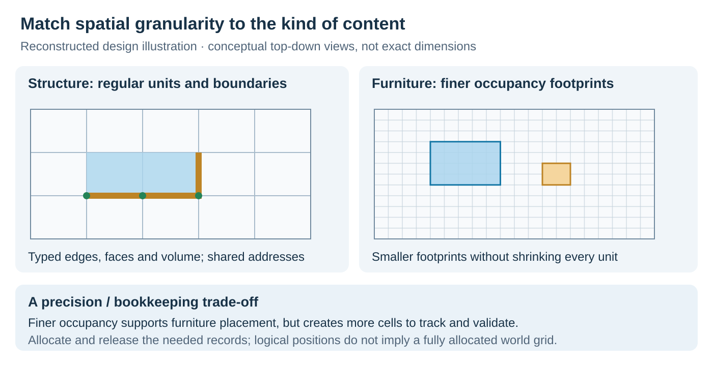

# Early building rules and spatial topology

[Overview](../README.md) · [System design](SYSTEM_DESIGN.md) · [Authoring workflow](AUTHORING_WORKFLOW.md)

**Early implemented version, 2021.** This was constrained assembly in a fixed building area, before the later free-form version shown in the gameplay gallery. I implemented structural pieces, furniture and decorations, then refactored their relationships as the variety of content grew.

The diagrams below are newly drawn explanations of that historical design. They are not engine captures or screenshots of an editor.

## Why the original abstraction became difficult

Walls, floors, stairs and furniture were intuitive categories. The difficulty was their relationships: walls connected to floors, stairs to floors, and variants introduced different heights and shapes. More categories did not make those connections easier to maintain.

I introduced **SpaceUnit** as a shared spatial model. Pieces described the support they needed, the support they provided and the spaces they occupied. Common operations could maintain those relationships instead of accumulating type-pair exceptions in the manager. Configuration presets could still use inheritance; the change was how building relationships were expressed.

## SpaceUnit with Pivot and Space

*Figure 1. Logical spatial positions and the description of one wall. Support relationships and occupancy have different meanings; physical mesh thickness is not defined by this diagram.*

**Pivots describe dependency and support capabilities.** The spatial coordinate system defines addressable edge, face and corner slots. Buildings register relationships at those slots. A logical location can exist without every possible runtime Pivot being allocated in advance.

**Spaces describe typed occupancy.** A wall occupies wall/face space; a beam can require edge space; other objects have volume requirements. An object can occupy several units. Different types do not automatically permit overlap: cross-type compatibility remains a rule.

For a basic wall, the description included:

- Required support along a bottom EdgePivot.
- Provided support at a top EdgePivot and two side-face Pivots.
- Occupancy in the wall's SideFrameSpace.

This separates **where a candidate can snap**, **what supports it**, and **which space it consumes**. A good snap candidate can still fail support, occupancy or material checks.

## Placement and removal

Placement maps the piece's position and orientation to relevant SpaceUnits, registers required/provided Pivots, and fills the occupied spaces, including unit boundaries. The descriptions give the common path the information it needs to update the model.

Removal has a further responsibility. It inspects dependent pieces and their remaining support before unregistering relationships and releasing occupancy. Removing one provider does not necessarily remove every source of support. Conversely, finding one remaining provider is insufficient if it does not provide the required capability. A shared Pivot therefore cannot be understood as one global active/inactive flag.

Recursive dependencies and mutually dependent pieces make this more involved than destroying an Actor and clearing a cell. The design must keep slot identity consistent across adjacent units and avoid treating duplicated boundary state as independent support.

## Different granularity for structure and furniture

*Figure 2. Structural assembly and furniture placement use different spatial granularity. The subdivisions are illustrative, not the project's exact cell sizes or scale.*

Structural pieces used SpaceUnit granularity. Furniture and decorations used finer voxel occupancy to support more detailed arrangement. Relevant spatial data was created and released dynamically.

That flexibility had a cost: finer data increased potential state size, and piece footprints, rotations and shared boundaries needed to agree with the visible object. I added dependency output, Pivot/Space visualisation and runtime configuration debugging so invalid placement could be inspected at the rule-data level.

## Why spatial slots rather than only object-owned sockets

This is a comparison of design approaches, not a claim about the internal implementation of Rust or LifeAfter.

**Spatial slots suited our constraints.** The area, assembly dimensions and orientations followed known conventions. Multiple pieces could refer to a shared location and type, with providers and occupancy maintained around that identity. Removing a wall withdrew its contribution while the location remained logically addressable. The cost was consistent slot indexing, provider bookkeeping and configuration. Arbitrary angles and irregular sizes required additional mappings or exceptions.

**Object-defined sockets suit different constraints.** Connection points follow each piece's local geometry, making irregular shapes and orientations more direct to author without a region-wide slot layout. Candidate search, compatibility, overlap and continued support still need rules. When several object endpoints should represent one shared connection, they need coordination too. Removing an instance-owned endpoint is different from removing a provider from a shared spatial slot.

Neither approach is universally better. A socket design can add a shared registry or support graph; a spatial design can use local points to generate candidates. I chose spatial slots because they fitted the assembly experience we were implementing. Later changes towards freer building were a reason to revisit that model.

## Content workflow and outcome

New content first checked whether existing Pivot/Space types could express its behaviour. New semantics required an implementation; otherwise, a preset and configuration could compose existing capabilities. Runtime visualisation made the resulting dependencies and occupied spaces inspectable. [Configuration and building-authoring workflows](AUTHORING_WORKFLOW.md).

I completed a working version with structural pieces and furniture, with the framework ready for further content expansion. The result was a common relationship model and a repeatable content path. Later free-form building and LiteMass were separate stages, not features of this early spatial model.

[Historical design and diagram scope](EVIDENCE.md#historical-system-design) · [Later placement and UI code](CODE_TOUR.md#3-follow-the-native-decision)
