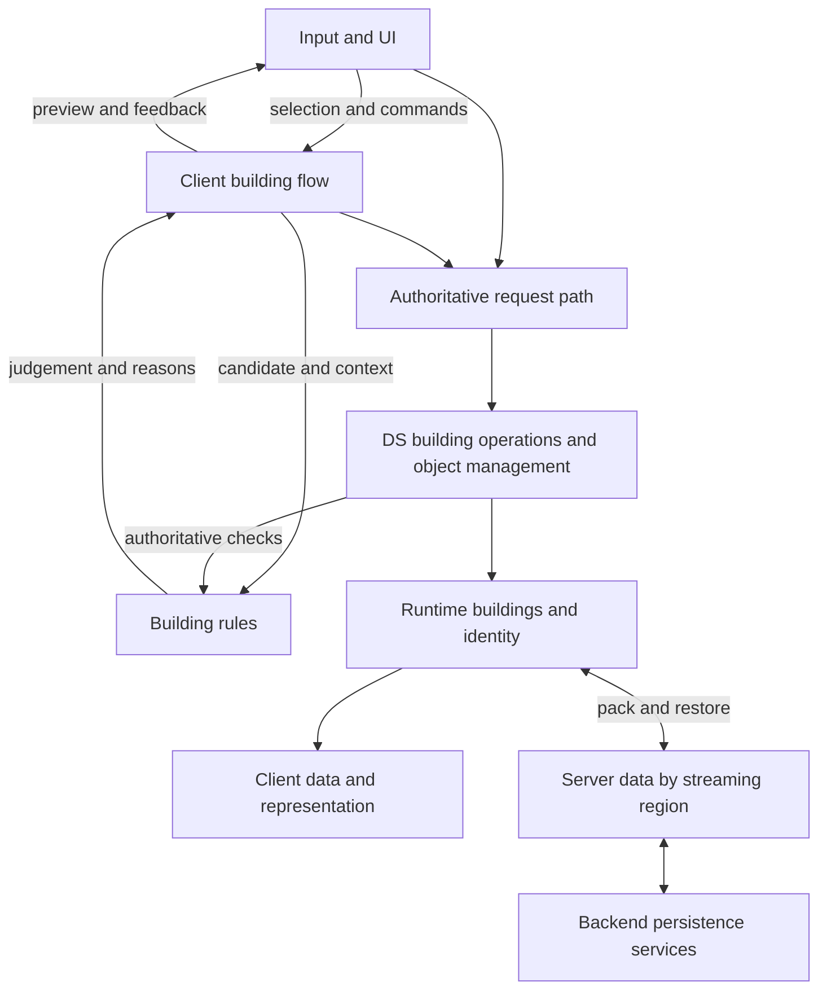

# Building system design

[Overview](../README.md) · [Spatial rules](SPATIAL_RULES.md) · [Lifecycles and LiteMass](LIFECYCLE_AND_SCALE.md) · [Authoring workflow](AUTHORING_WORKFLOW.md)

I designed the system around a complete player action: choose an object, adjust its preview, confirm placement, and retain the result in the world. Players could later move or remove it, or use its crafting, cooking or storage interaction.

That journey crosses several lifetimes. An input lasts a moment, a preview lasts for an operation, and an accepted building can survive sessions and region unloads. I separated responsibilities around those differences so changes to controls, rules and storage had a clear main place to go.

## Responsibilities

### Input and UI

The input/UI layer presents content, receives player actions and turns them into building commands. PC and mobile have different controls and layout choices, but both drive the same native gameplay operations. The interface shows selection, available actions and failure reasons without owning authoritative building state.

The intended boundary puts operation entry points here and continuous interaction in the flow. In practice, the native flow also contains request dispatch. These are responsibility boundaries across cooperating code, not five perfectly isolated classes.

### Building flow

The flow manages the current client operation: selected piece, preview, candidate positions, rotation, adjustments, cancellation and continuation. Camera and scene context suggest candidates; rules help evaluate them; preview and UI feedback explain the result.

This keeps per-frame interaction separate from persistence. Closing the catalogue, cancelling a preview and leaving building mode are different intentions, while a placed building continues to exist independently. The [included placement path](CODE_TOUR.md#3-follow-the-native-decision) shows how the flow publishes available operations to Lua.

### Building rules

Rules cover spatial validity, materials and structural support. Their callers extend beyond preview placement: the client needs early feedback, the dedicated server needs authoritative validation, and existing buildings may need support recalculation after the structure changes.

Shared responsibility does not require identical execution on both sides. Available data, timing and authority differ. It also does not imply a completely pure function library: some implementations query world/player context and coordinate resulting changes.

The early version represented constraints through [SpaceUnit, Pivot and Space](SPATIAL_RULES.md). Later free-form building required a different spatial model. Keeping those rules separate from input and operation state let the interaction flow remain useful through that evolution.

### Object management

Object management provides building lookup and domain operations, including creation, movement, deletion and coordination with other gameplay systems. It connects building state, relevant player context, rules and functional objects.

It is more than a collection of Actor pointers, but it should not absorb every UI, rule and storage implementation. Its cost is coordination: callers need consistent identity and results even when an object is loading, has changed representation or no longer exists.

### Server data

Server Data exchanges building records with backend services and organises saving and restoration by server streaming region. It restores the runtime buildings needed for a loaded region and coordinates their release when that region unloads.

Saving and restoring are separate from a player's current operation. A successful confirm does not imply a synchronous database commit, and unloading an Actor does not mean demolishing a building. Runtime player construction is saved as records, not by rewriting Unreal map assets.

## One accepted placement

This diagram shows responsibility and data relationships. Networking, asset loading and persistence complete on their own schedules.

The client proposes an operation. The DS validates current authoritative conditions and coordinates resource use and creation. Runtime data then drives replication and world representation. Structural changes can later trigger support checks without the building UI being open.

## Individual building design

On the Actor path, a shared base class provides common building identity, lifecycle and interfaces. Components provide capabilities such as snapping and interaction, while complex production objects retain specialised behaviour.

An interaction component connects a world entry point to gameplay. It does not need to own crafting rules, inventory mutation and the entire panel implementation. The same distinction makes it possible to compose capabilities without turning the base class into a catalogue of every functional building.

Building data and the loaded Actor have separate roles. The saved record retains identity and state; a runtime entity or Actor provides currently loaded behaviour and representation. That separation later helped us integrate LiteMass, with simple types using data entities and shared representation while complex functional objects could retain Actors.

## How requirements tested the boundaries

- **Structured assembly became freer placement.** The main changes concerned spatial rules and candidate evaluation. Selection, preview and confirmation remained useful, although feedback and integration also evolved.
- **A fixed area became an open world.** Building data moved from player-owned structures towards storage organised by server streaming regions. The main change concerned world ownership and save/restore lifetime.
- **Building counts increased.** Individual identity was retained while runtime representation and replication could be grouped. LiteMass integration added mapping and lifecycle work rather than changing what a player meant by selecting one wall.
- **Content production expanded.** I connected authoring, saving for later edits, export and editor placement, then extended that foundation into player blueprints. [Workflow](AUTHORING_WORKFLOW.md).

The value was containing change, not eliminating dependencies. Each boundary needed explicit context, identity and lifecycle handling. [Representation and persistence detail](LIFECYCLE_AND_SCALE.md).

## UI implementation route

For concrete exported code, continue with the [C++ / Lua / UMG interaction contracts](ARCHITECTURE.md) and [guided code tour](CODE_TOUR.md). They cover the later placement and object-interaction paths. The broader historical architecture is documented here; its implementation and visual scope are collected in [Evidence](EVIDENCE.md).
